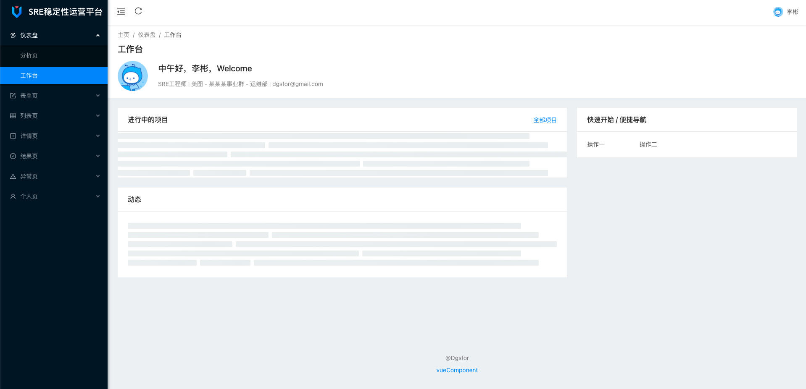
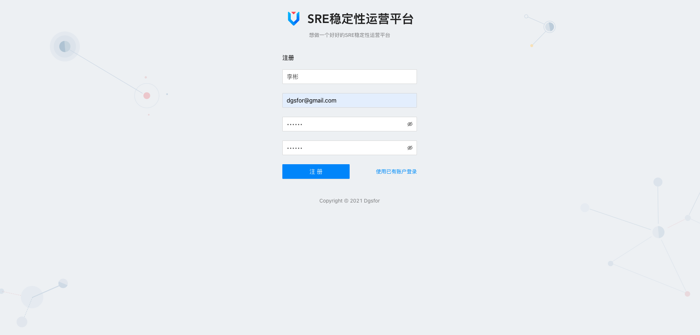
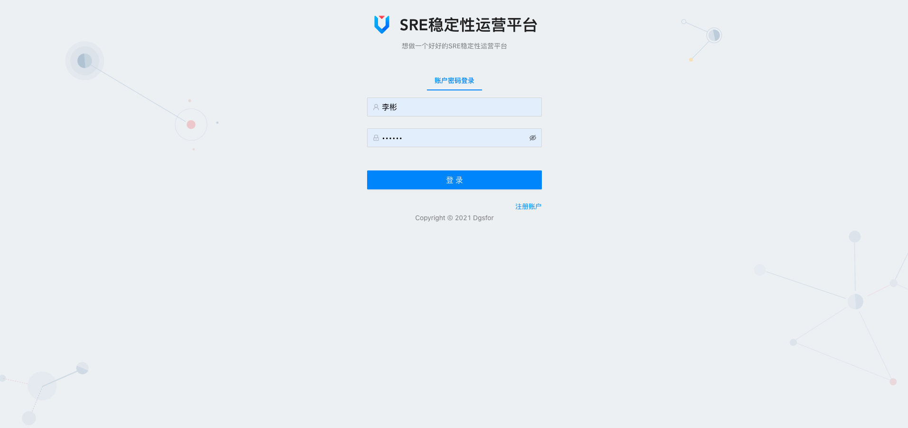

<h1 align="center">SRE稳定性运营平台</h1>
<div align="center">
一个致力于SRE稳定性运营工作的平台
</div>

<div align="center">

[](https://github.com/gsgs-libin/sre_cerebrum/blob/main/LICENSE)

</div>

Overview
----

基于 [Ant Design Vue Pro](https://github.com/vueComponent/ant-design-vue-pro) 实现的





环境和依赖
----

- node
- yarn
- webpack
- eslint
- @vue/cli
- [ant-design-vue@1.x](https://github.com/vueComponent/ant-design-vue) - Ant Design Of Vue 实现
- [vue-cropper](https://github.com/xyxiao001/vue-cropper) - 头像裁剪组件
- [@antv/g2](https://antv.alipay.com/zh-cn/index.html) - Alipay AntV 数据可视化图表
- [Viser-vue](https://viserjs.github.io/docs.html#/viser/guide/installation)  - antv/g2 封装实现


项目下载和运行
----

- 拉取项目代码
```bash
git clone https://github.com/gsgs-libin/sre_cerebrum.git
cd sre_cerebrum
```

- 安装依赖
```
yarn install
```

- 开发模式运行
```
yarn run serve
```

- 编译项目
```
yarn run build
```

- Lints and fixes files
```
yarn run lint
```


其他说明
----
